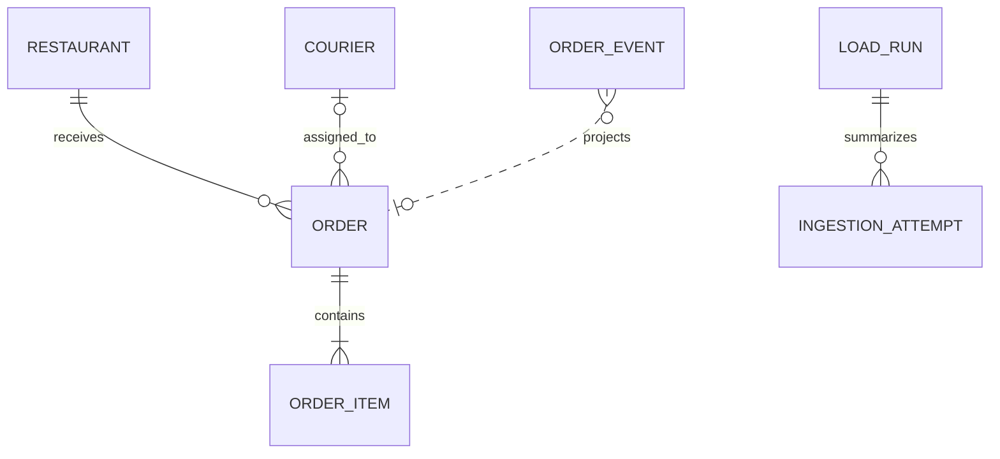
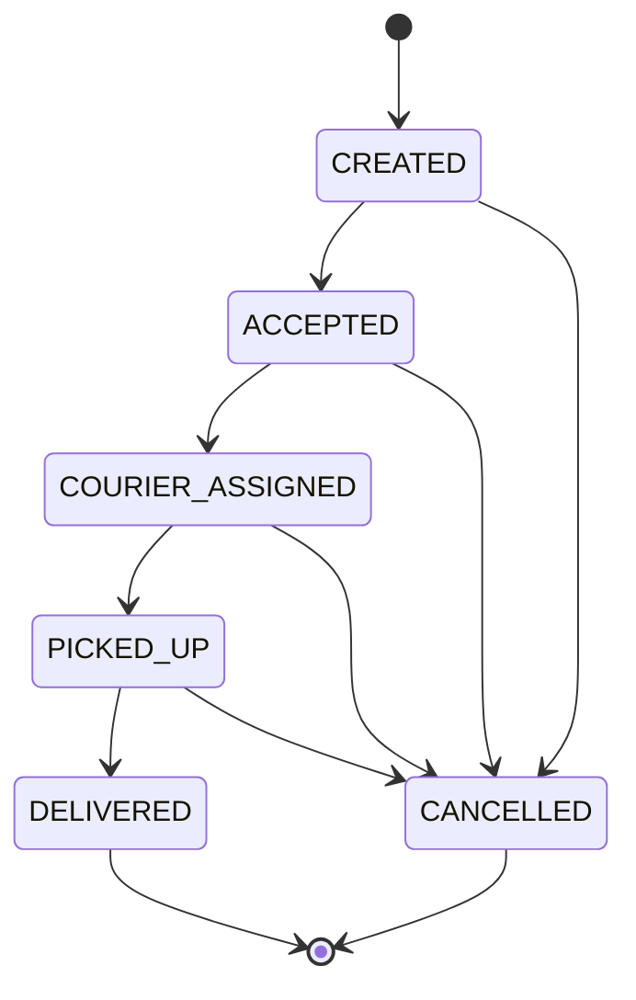

# Data Model: Order Event Ingestion

## Modeling rules

- PostgreSQL names use `snake_case`; domain and TypeScript names use English `camelCase`.
- All timestamps are timezone-aware UTC instants.
- All monetary values are signed 64-bit integer cents with non-negative checks.
- Source event fields are immutable after insertion. Processing outcome may change when replay turns a
  pending event into an applied or historical event.
- `orders` is the current projection. `order_events` remains the reconstruction source of truth.
- TypeORM entity definitions live in infrastructure and map to framework-free domain objects.
- `synchronize` is always disabled; the initial and subsequent schemas exist only as migrations.

## Enumerations

### OrderEventType

- `ORDER_CREATED`
- `ORDER_STATUS_CHANGED`

### OrderStatus

- `CREATED`
- `ACCEPTED`
- `COURIER_ASSIGNED`
- `PICKED_UP`
- `DELIVERED`
- `CANCELLED`

### EventActor

- `USER`
- `RESTAURANT`
- `COURIER`
- `SYSTEM`
- `OPS`

### CityCode

- `BOG`
- `MEX`
- `LIM`

### Weather

- `CLEAR`
- `RAIN`
- `STORM`

### EventProcessingOutcome

- `APPLIED`: contributes the current projection or a transition that led to it.
- `HISTORICAL`: valid and ordered before the current projection without changing it.
- `PENDING_SEQUENCE`: valid source fact whose creation or predecessor transition is missing.
- `REJECTED_CONFLICT`: unique input retained for diagnosis but excluded from projection.

### IngestionOutcome

- `APPLIED`
- `HISTORICAL`
- `PENDING`
- `DUPLICATE`
- `REJECTED_VALIDATION`
- `REJECTED_CONFLICT`

## Entity: Order

Current durable projection for a created order. There is no placeholder order: pre-creation events
remain in `order_events` until an `ORDER_CREATED` event makes projection possible.

| Field | Type | Rules |
|---|---|---|
| `order_id` | varchar(64) | Primary key; source identifier |
| `user_id` | varchar(64) | Required |
| `city` | `CityCode` | Required |
| `restaurant_id` | varchar(64) | Required foreign key to Restaurant |
| `courier_id` | varchar(64), nullable | Foreign key to Courier when assigned |
| `current_status` | `OrderStatus` | Required |
| `current_event_id` | varchar(64) | Required reference to the event that establishes current state |
| `status_occurred_at` | timestamptz | Required; source-time of current status |
| `promised_at` | timestamptz | Required; later than creation occurrence |
| `weather` | `Weather` | Required |
| `total_amount_cents` | bigint | Required, non-negative, safe integer at application boundary |
| `projection_version` | integer | Starts at 1; increments only when projection content changes |
| `created_at` | timestamptz | Database insertion time |
| `updated_at` | timestamptz | Last projection update time |

Indexes: `current_status`, `city`, `status_occurred_at`, `restaurant_id`, `courier_id`. The first
two anticipate later list queries without adding those endpoints in this feature.

## Entity: OrderItem

Immutable item snapshot from `ORDER_CREATED`.

| Field | Type | Rules |
|---|---|---|
| `order_id` | varchar(64) | Parent Order; cascade delete is disabled in application workflows |
| `line_number` | smallint | Positive; unique within order |
| `sku` | varchar(128) | Required |
| `name` | varchar(256) | Required, trimmed |
| `quantity` | integer | Required, greater than zero |
| `unit_price_cents` | bigint | Required, non-negative |

Primary key: (`order_id`, `line_number`). The sum of `quantity * unit_price_cents` must equal the
order total for this dataset contract.

## Entity: OrderEvent

Immutable source fact plus recalculable processing metadata.

| Field | Type | Rules |
|---|---|---|
| `event_id` | varchar(64) | Primary key; globally unique idempotency key |
| `order_id` | varchar(64) | Required; indexed; intentionally no Order FK so pre-creation events can exist |
| `event_type` | `OrderEventType` | Required |
| `status` | `OrderStatus`, nullable | Required only for `ORDER_STATUS_CHANGED`; forbidden for creation |
| `occurred_at` | timestamptz | Required source-time; projection ordering truth |
| `received_at` | timestamptz | Required diagnostic-time; never used to order state |
| `actor` | `EventActor` | Required |
| `courier_id` | varchar(64), nullable | Allowed when status is `COURIER_ASSIGNED` |
| `cancel_reason` | varchar(128), nullable | Allowed when status is `CANCELLED` |
| `payload` | jsonb | Canonical source payload retained for audit |
| `content_hash` | char(64) | SHA-256 of canonicalized full event; immutable |
| `processing_outcome` | `EventProcessingOutcome` | Recomputed inside the order transaction |
| `rejection_code` | varchar(64), nullable | Stable reason when outcome is rejected |
| `ingestion_sequence` | bigint identity | Unique, monotonic tie-breaker for equal source times |
| `created_at` | timestamptz | First persistence time |
| `processed_at` | timestamptz | Last reduction time |

Indexes:

- (`order_id`, `occurred_at`, `ingestion_sequence`) for deterministic replay.
- (`processing_outcome`, `created_at`) for pending/conflict diagnosis.
- Unique `event_id` is the database-level idempotency guarantee.

## Entity: Restaurant

Reference data loaded before events.

| Field | Type | Rules |
|---|---|---|
| `restaurant_id` | varchar(64) | Primary key |
| `name` | varchar(256) | Required |
| `city` | `CityCode` | Required |
| `latitude` / `longitude` | double precision | Valid geographic ranges |
| `avg_prep_minutes` | integer | Positive |
| `rating` | numeric(2,1) | 0.0 through 5.0 |

## Entity: Courier

Sensitive reference data loaded before events. Only `courier_id` may cross the US1 HTTP response
boundary; name, phone, and document are never serialized.

| Field | Type | Rules |
|---|---|---|
| `courier_id` | varchar(64) | Primary key |
| `full_name` | varchar(256) | Sensitive; required |
| `phone` | varchar(32) | Sensitive; required |
| `document_id` | varchar(64) | Sensitive; required; unique |
| `vehicle` | varchar(32) | Required |
| `city` | `CityCode` | Required |
| `rating` | numeric(2,1) | 0.0 through 5.0 |

## Entity: IngestionAttempt

Diagnostic record for attempts that cannot be represented by a second unique event row, especially
exact duplicates and mutated reuse of an `event_id`.

| Field | Type | Rules |
|---|---|---|
| `attempt_id` | uuid | Primary key |
| `load_run_id` | uuid, nullable | Foreign key to LoadRun for CLI attempts; null for normal HTTP ingestion |
| `event_id` | varchar(64) | Required; indexed |
| `order_id` | varchar(64), nullable | Present when parseable |
| `content_hash` | char(64), nullable | Present after canonicalization |
| `outcome` | `IngestionOutcome` | Duplicate, validation failure, or conflict |
| `reason_code` | varchar(64), nullable | Stable diagnostic code |
| `details` | jsonb, nullable | Redacted validation metadata; no courier PII |
| `attempted_at` | timestamptz | Required |

Retention is not automated in US1; records remain available for the local exercise.

## Entity: LoadRun

Audit summary for one CLI invocation.

| Field | Type | Rules |
|---|---|---|
| `load_run_id` | uuid | Primary key |
| `source_fingerprint` | char(64) | Hash of source files and normalized options |
| `seed` | bigint, nullable | Present for synthetic generation |
| `status` | varchar(16) | `RUNNING`, `COMPLETED`, or `FAILED` |
| `total_events` | integer | Non-negative |
| `applied_count` | integer | Non-negative |
| `pending_count` | integer | Non-negative |
| `historical_count` | integer | Non-negative |
| `duplicate_count` | integer | Non-negative |
| `rejected_count` | integer | Non-negative |
| `started_at` / `completed_at` | timestamptz | Completion nullable while running |
| `failure_summary` | text, nullable | Redacted human-readable failure |

Repeated source fingerprints are allowed: each run proves idempotency independently.

## Relationships

`OrderEvent.order_id` is a logical relationship rather than a foreign key because events may
precede order creation. `LoadRun` counts attempts; no per-row foreign key is required for normal HTTP
ingestion, so `load_run_id` on IngestionAttempt is nullable in the physical schema.

## Projection state machine

Non-cancellation transitions cannot skip states. A syntactically valid event that currently lacks
its predecessor is `PENDING_SEQUENCE`, not rejected. Each new event replays the full order timeline,
which may promote prior pending events.

## Transaction and reduction sequence

1. Parse, bound, validate, canonicalize, and hash the external event.
2. Open a transaction and acquire a transaction-level advisory lock for `order_id`.
3. Look up `event_id`:
   - Same hash: write a `DUPLICATE` attempt and return without projection changes.
   - Different hash: write an `EVENT_ID_CONFLICT` attempt and return conflict.
4. Insert the unique source event with an initial pending outcome.
5. Load all unique events for `order_id` ordered by `occurred_at`, then `ingestion_sequence`.
6. Run the pure reducer and update processing outcomes.
7. Upsert or replace the Order projection and its items only when a valid creation exists.
8. Commit event, outcomes, projection, and attempt atomically; roll back all on failure.

## Validation invariants

- IDs are 1-64 characters using letters, numbers, underscore, or hyphen.
- Payload depth, item count, string lengths, and total body size are bounded by the HTTP contract.
- `ORDER_CREATED` requires at least one item, a valid city/weather, and `promised_at` after
  `occurred_at`.
- `ORDER_STATUS_CHANGED` requires a status other than `CREATED`.
- Courier ID is required only for `COURIER_ASSIGNED`; cancel reason is required for `CANCELLED`.
- `received_at` may precede or follow another event's received time but must be a valid timestamp.
- Equal `occurred_at` values with incompatible events preserve the earlier ingestion and mark the
  later event `REJECTED_CONFLICT`.
- Events occurring after a terminal event are retained for diagnosis as rejected and never affect
  the Order projection.
