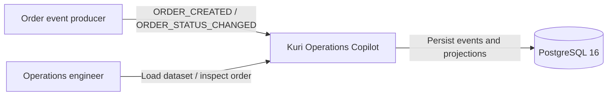
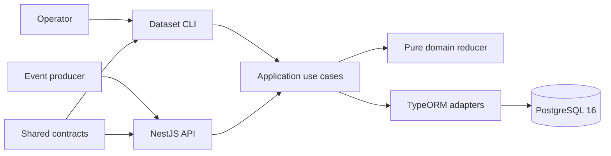
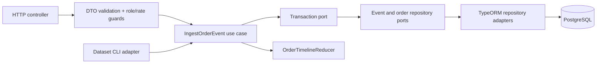

# Implementation Plan: Order Event Ingestion

**Branch**: `main` | **Date**: 2026-09-15 | **Spec**: [spec.md](./spec.md)

**Input**: Feature specification from `specs/001-order-event-ingestion/spec.md`

## Summary

Construir el núcleo de datos de pedidos como un módulo hexagonal de NestJS que reciba eventos
idempotentes, preserve hechos fuera de orden y recalcule una proyección determinista por pedido.
PostgreSQL 16 será la fuente durable; TypeORM quedará limitado a adaptadores de infraestructura y
migraciones versionadas. Cada ingesta se ejecutará en una transacción con exclusión por `order_id`,
restricción única de `event_id` y reducción completa de la línea temporal del pedido.

## Architecture Overview

### C4 Level 1 - System Context



### C4 Level 2 - Containers



### C4 Level 3 - Ingestion Components



The HTTP and CLI adapters normalize external decimal amounts to integer cents before invoking the
application layer. The domain receives no framework, ORM, HTTP, or database types.

## Technical Context

**Language/Version**: Node.js 22.23, TypeScript 5.9-compatible project configuration

**Primary Dependencies**: NestJS 11, TypeORM 0.3, `@nestjs/typeorm`, PostgreSQL driver `pg`,
`class-validator`, `class-transformer`, `@nestjs/config`, `@nestjs/throttler`

**Storage**: PostgreSQL 16 in Docker; TypeORM migrations with `synchronize: false`; JSONB only for
immutable source payloads, with query-critical fields normalized into columns

**Testing**: Jest and Supertest; pure unit tests for reduction and money normalization; repository
integration and HTTP end-to-end tests against PostgreSQL 16

**Target Platform**: Local Docker Compose on macOS/Linux hosts; Linux containers; arm64 and amd64

**Project Type**: pnpm monorepo with backend web service, shared contract package, and data CLI

**Performance Goals**: p95 single-event response below 250 ms locally after warm-up; deterministic
load of approximately 1,500 orders and their events in under 60 seconds; concurrent events for the
same order produce one serial result without duplicates

**Constraints**: One local startup command; no external queue; no cloud dependency; money stored as
integer cents; `occurred_at` determines temporal truth; real authorization from simulated roles;
no courier PII in HTTP responses; all schema changes use migrations

**Scale/Scope**: Approximately 1,500 seeded orders for acceptance, 3% duplicate events, 5%
out-of-order delivery, and a design suitable for tens of thousands of orders per day. This feature
implements direct order lookup and timeline inspection only; filtering, risk, support, approvals,
LLM, and frontend remain excluded.

## Constitution Check

*GATE: Passed before research and re-checked after Phase 1 design.*

| Principle / Gate | Design Evidence | Status |
|---|---|---|
| Domain isolation | Domain reducer and value objects import no NestJS or TypeORM types; ports live in the application boundary. | PASS |
| Temporal truth and idempotency | Unique `event_id`, canonical content hash, `occurred_at` ordering, pending transitions, and deterministic replay are explicit. | PASS |
| Safety, privacy, authorization | Strict DTO validation, role guard, throttling, bounded payloads, and response DTOs without courier PII. | PASS |
| Evidence-based quality | Reducer, transition graph, money, duplicate, conflict, persistence, restart, and endpoint scenarios have test layers. | PASS |
| Local reproducibility | PostgreSQL 16 and API run in Docker; migrations and deterministic seed/load commands are documented. | PASS |
| UX and microinteractions | No UI is introduced. HTTP/CLI outcomes are explicit, stable, and in clear Spanish where human-facing. | PASS |
| Versioned contracts and schema | OpenAPI, CLI contract, shared types, and reviewed TypeORM migration files are versioned. | PASS |

Post-design review: the data model keeps source events auditable while separating mutable processing
outcomes; the contracts expose no protected courier fields; the quickstart proves every critical
acceptance path. No constitutional exception is required.

## Project Structure

### Documentation (this feature)

```text
specs/001-order-event-ingestion/
├── plan.md
├── research.md
├── data-model.md
├── quickstart.md
├── contracts/
│   ├── openapi.yaml
│   └── data-load.md
└── tasks.md                  # Created later by $speckit-tasks
```

### Source Code (repository root)

```text
api/
├── src/
│   ├── domain/orders/
│   │   ├── entities/
│   │   ├── value-objects/
│   │   ├── services/
│   │   └── errors/
│   ├── application/orders/
│   │   ├── ports/
│   │   ├── use-cases/
│   │   └── dto/
│   ├── infrastructure/
│   │   ├── config/
│   │   ├── database/typeorm/
│   │   │   ├── entities/
│   │   │   ├── migrations/
│   │   │   └── repositories/
│   │   ├── http/
│   │   │   ├── controllers/
│   │   │   ├── dto/
│   │   │   ├── guards/
│   │   │   └── filters/
│   │   └── cli/
│   └── app.module.ts
├── test/
│   ├── contract/
│   ├── integration/
│   └── e2e/
└── data/
    ├── fixtures/
    └── generated/

packages/
└── contracts/
    └── src/order-events.ts

compose.yaml
.env.example
```

**Structure Decision**: Keep one bounded order module inside `api/`, divided into domain,
application, and infrastructure layers. TypeORM entities are separate from domain entities. A
small workspace package owns transport-safe shared contracts so later frontend work consumes the
same enums and response shapes without importing the API application.

## Complexity Tracking

No constitution violations require justification. The event ledger plus projection is necessary
to satisfy replay and audit requirements; the additional ingestion-attempt table exists only for
duplicate/conflict diagnostics that cannot share the unique event row.
